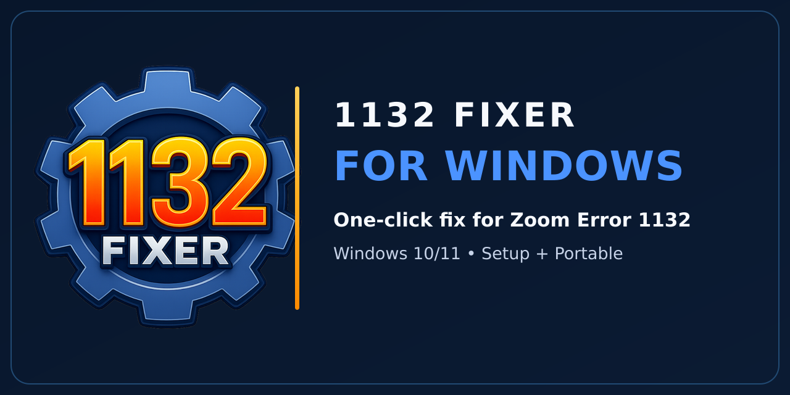

<p align="center">
  
</p>

<h1 align="center">1132 Fixer for Windows</h1>

<p align="center">
  <strong>Open-source, one-click fix for Zoom Error 1132 on Windows.</strong><br>
  Opens Zoom Workplace under a separate local helper account so a profile-tied 1132 ban no longer blocks you.
</p>

<p align="center">
  <a href="LICENSE"></a>
  
  
  <a href="https://github.com/1132-Fixer/windows/actions/workflows/ci.yml"></a>
  <a href="https://github.com/1132-Fixer/windows/releases/latest"></a>
</p>

<p align="center">
  <a href="https://github.com/1132-Fixer/windows/releases/latest"><strong>Download the latest release</strong></a>
  &nbsp;┬╖&nbsp;
  <a href="https://1132-fixer.xyz/"><strong>Website</strong></a>
  &nbsp;┬╖&nbsp;
  <a href="CONTRIBUTING.md"><strong>Contribute</strong></a>
  &nbsp;┬╖&nbsp;
  <a href="SECURITY.md"><strong>Security</strong></a>
</p>

This is the **canonical public source** for the Windows app. Issues, pull requests, CI, and GitHub Releases all live here: [`1132-Fixer/windows`](https://github.com/1132-Fixer/windows).

Companion products in the same organization:

- [macOS](https://github.com/1132-Fixer/macos)
- [Chrome](https://github.com/1132-Fixer/chrome)

---

## What it does

Error 1132 can stay after Zoom is reinstalled. It is often tied to a Windows user profile, not the Zoom installer.

1132 Fixer resets a separate helper account named `user1`, then opens Zoom under that account.

When you press **Fix now**, the app:

1. Checks Windows, admin access, and the Zoom install.
2. Stops active `user1` sessions and removes the old helper profile.
3. Recreates `user1` and applies safe session settings.
4. Opens and checks Zoom Workplace as `user1`.
5. Creates or repairs the desktop shortcut.
6. Shows a clear result when the work is done.

## Main features

| Feature | What it gives you |
| --- | --- |
| Automatic checks | Finds blockers before the fix starts. |
| One-click flow | Runs the full fix from one main button. |
| Fix receipt | Shows what worked and what needs attention. |
| Desktop shortcut | Creates or repairs a shortcut that opens Zoom as `user1`. |
| Camera and microphone setup | Applies safe Windows desktop-app consent settings. |
| Support report | Builds a redacted report you can review before sharing. |
| Feedback | Opens bug, rating, and general feedback choices. |
| Two builds | Setup installer or a portable `.exe`. |

## Important safety note

> [!IMPORTANT]
> 1132 Fixer deletes and recreates the local `user1` helper account. Anything stored in that helper profile is removed. It does not delete files or Zoom data from your normal Windows profile. Do not run it while signed in to Windows as `user1`.

The app manages this local account:

```text
Username: user1
Password: random ΓÇö a fresh one is generated on every fix run
```

- You never need the password. The desktop shortcut signs in for you: the fix stores the password encrypted with Windows DPAPI in `%APPDATA%\1132 Fixer\helper-credential.bin`, next to the shortcut launcher (`launch-zoom-as-user1.ps1`). Only your own Windows account can decrypt it. No plain-text password is written to disk. Shortcuts from older versions keep working and are upgraded on the next fix run.
- `user1` is a **standard user**, not an administrator. If an older version made it an administrator, the next fix run removes those rights.
- Do not use `user1` as your everyday Windows account.
- The app may ask for Windows admin approval.

## Requirements

- Windows 10 or Windows 11, x64
- Administrator access
- The Windows **Secondary Logon** service must be available
- Zoom Workplace installed (machine-wide). The default path is:

  ```text
  C:\Program Files\Zoom\bin\Zoom.exe
  ```

  Other machine-wide install locations are detected automatically.

## Install and use

1. Download the latest [Setup or Portable build](https://github.com/1132-Fixer/windows/releases/latest).
2. Open **1132 Fixer** (Run as administrator if Windows asks).
3. Read the safety note.
4. Press **Fix now**.
5. Approve any Windows prompt.
6. Sign in to Zoom in the new session.
7. Create the desktop shortcut if you want faster access next time.

If you installed **v5.5.1 or earlier**, automatic updates from the old download location no longer apply. Install the latest release from this repository once. After that, updates come from this project's GitHub Releases.

## Privacy

- The fix runs on your PC.
- The app does not send a report unless you press **Submit**.
- Support reports hide common private values such as usernames, profile paths, and SIDs.
- Read any report before you attach it.

## Quick help

| Problem | Try this |
| --- | --- |
| The app says admin access is missing | Close it, then choose **Run as administrator**. |
| Zoom is not found | Install Zoom Workplace with the machine-wide installer. |
| The fix button stays disabled | Read the check rows and fix the item marked in red. |
| Security software blocks the fix | Allow the app to create the local helper account and start Zoom. |
| Camera or microphone is missing | Check Windows privacy settings, the hardware shutter, the camera driver, and any antivirus webcam shield. |

<details>
<summary><strong>Camera and microphone details</strong></summary>

Open Windows as `user1`, then go to:

```text
Settings → Privacy & security → Camera
```

Turn on **Camera access** and **Let desktop apps access your camera**. Check the matching microphone page too.

If those controls are already on, check the laptop camera shutter, a camera function key, antivirus webcam protection, Device Manager for a driver warning, and any organization or MDM policy.

</details>

## Open source

1132 Fixer for Windows is MIT-licensed. You may use, copy, modify, merge, publish, distribute, sublicense, and sell copies of the software, provided the copyright notice and permission notice stay with it. See [LICENSE](LICENSE).

Name, logo, and product marks remain 1132 Fixer marks. Using the software under MIT does not grant trademark rights. Keep attribution to this repository in forks and copies:

`https://github.com/1132-Fixer/windows`

## Develop

```bash
git clone https://github.com/1132-Fixer/windows.git
cd 1132-Fixer-Windows
npm ci
npm test
npm start
```

Build (Windows x64):

```bash
npm run build:all
```

Version bump:

```bash
node scripts/bump-version.js patch
npm install --package-lock-only
```

A `v*` tag on `master` runs `.github/workflows/release.yml`, which builds Setup and Portable artifacts, checksums, and `latest.yml` onto this repository's GitHub Releases.

Secrets belong in GitHub Actions or the feedback service ΓÇö never in app source or a packaged config. See [CONTRIBUTING.md](CONTRIBUTING.md) and [docs/BUILDING.md](docs/BUILDING.md).

## Independent project

1132 Fixer is not made by, endorsed by, or affiliated with Zoom Video Communications, Inc.
